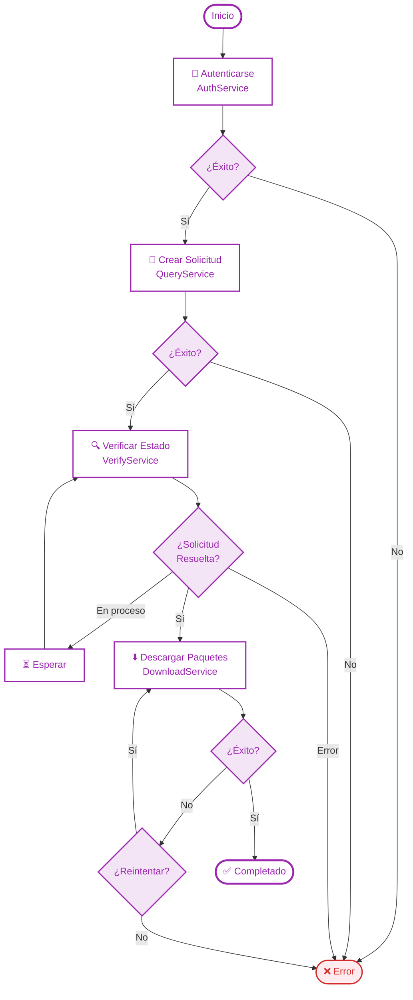

# 🧾 Fiscalapi XML Downloader (sat-ws-descarga-masiva)

[](https://www.nuget.org/packages/Fiscalapi.XmlDownloader)
[](https://dotnet.microsoft.com/download/dotnet/8.0)
[](LICENSE)

## 📋 Descripción

Librería .NET para consultar y descargar facturas (CFDI) emitidas y recibidas a través del servicio web del SAT, incluyendo la obtención de metadata. Este servicio es parte del sistema "Consulta y recuperación de comprobantes" del SAT.

## 🎯 Casos de Uso

- **Automatización de cadena de suministros** - Descarga automática de facturas de proveedores
- **Automatización de cuentas por pagar** - Gestión de facturas recibidas
- **Automatización de cuentas por cobrar** - Control de facturas emitidas
- **Contabilidad electrónica** - Integración con sistemas contables
- **Generación de pólizas contables** - Procesamiento automático de comprobantes

## 📦 Instalación

```bash
# Package Manager
Install-Package Fiscalapi.XmlDownloader

# .NET CLI
dotnet add package Fiscalapi.XmlDownloader
```

> **📌 Dependencia requerida:** Esta librería depende de `Fiscalapi.Credentials`. Se recomienda leer su documentación antes de continuar.

## 🔄 Flujo de Operación



## 📊 Reglas de Negocio y Validaciones

### Estados Permitidos por Tipo de Consulta

| Tipo Descarga | Tipo Consulta | Estados Permitidos |
|---------------|---------------|-------------------|
| **Emitidos** | CFDI | Vigente, Cancelado, Todos |
| **Emitidos** | Metadata | Vigente, Cancelado, Todos |
| **Recibidos** | CFDI | Solo Vigente |
| **Recibidos** | Metadata | Vigente, Cancelado, Todos |

### Validaciones Principales

- **Fechas**: La fecha inicial debe ser menor a la fecha final
- **UUID**: Debe tener exactamente 36 caracteres (cuando se especifica)
- **Límites de registros**: Hasta 200,000 por petición (1,000,000 en metadata)
- **Tipos de consulta**: Solo valores válidos definidos en `SatQueryTypes`
- **Estados de factura**: Solo valores válidos según el tipo de descarga

## 🚀 Ejemplo de Uso

```csharp
using Fiscalapi.XmlDownloader;
using Fiscalapi.XmlDownloader.Models;

internal class Program
{
    private static async Task Main(string[] args)
    {
        // Configuración de credenciales FIEL
        var certBase64 = "certBase64...";
        var keyBase64 = "keyBase64...";
        var password = "keyPassPhrase...";
        
        var service = new XmlDownloaderService();
        
        try
        {
            // 1. Autenticación con FIEL
            Console.WriteLine("Autenticando...");
            await service.AuthenticateAsync(certBase64, keyBase64, password);
            
            // 2. Crear solicitud de descarga
            Console.WriteLine("Creando solicitud...");
            var queryParams = new QueryParameters
            {
                StartDate = new DateTime(2024, 1, 1).ToStartOfDay(),
                EndDate = new DateTime(2024, 1, 30).ToEndOfDay(),
                RecipientTin = "RFC123456789", // RFC del receptor
                RequestType = QueryType.CFDI,
                InvoiceStatus = InvoiceStatus.Vigente
            };
            
            var queryResponse = await service.CreateRequestAsync(queryParams);
            
            if (!queryResponse.Succeeded)
            {
                Console.WriteLine($"Error creando solicitud: {queryResponse.SatMessage}");
                return;
            }
            
            Console.WriteLine($"Solicitud creada exitosamente: {queryResponse.RequestId}");
            
            // 3. Verificar estado de la solicitud
            Console.WriteLine("Verificando estado de la solicitud...");
            var verifyResponse = await service.VerifyAsync(queryResponse.RequestId);
            
            if (!verifyResponse.Succeeded)
            {
                Console.WriteLine($"Error verificando solicitud: {verifyResponse.SatMessage}");
                return;
            }
            
            Console.WriteLine($"Estado SAT: {verifyResponse.SatStatus}");
            Console.WriteLine($"Estado Solicitud: {verifyResponse.RequestStatus}");
            Console.WriteLine($"Facturas encontradas: {verifyResponse.InvoiceCount}");
            
            // 4. Descargar paquetes si están listos
            if (verifyResponse.IsReadyToDownload)
            {
                Console.WriteLine($"Descargando {verifyResponse.PackageIds.Count} paquete(s)...");
                
                foreach (var packageId in verifyResponse.PackageIds)
                {
                    Console.WriteLine($"Descargando paquete: {packageId}");
                    var downloadResponse = await service.DownloadAsync(packageId);
                    
                    if (downloadResponse.Succeeded)
                    {
                        // Guardar paquete en disco
                        var packagePath = Path.Combine("C:\\FiscalAPI\\packages", $"{packageId}.zip");
                        await service.WritePackageAsync(packagePath, downloadResponse.PackageBytes);
                        Console.WriteLine($"Paquete guardado en: {packagePath}");
                        
                        // Procesar comprobantes del paquete
                        Console.WriteLine("Procesando comprobantes...");
                        await foreach (var comprobante in service.GetComprobantesAsync(downloadResponse.PackageBytes))
                        {
                            Console.WriteLine($"CFDI procesado - Serie: {comprobante.Serie}, Folio: {comprobante.Folio}");
                        }
                    }
                    else
                    {
                        Console.WriteLine($"Error descargando paquete {packageId}: {downloadResponse.SatMessage}");
                    }
                }
            }
            else
            {
                Console.WriteLine($"La solicitud no está lista para descarga. Estado: {verifyResponse.RequestStatus}");
            }
            
            Console.WriteLine("Proceso completado exitosamente");
        }
        catch (Exception ex)
        {
            Console.WriteLine($"Error general: {ex.Message}");
        }
    }
}
```

## 🔧 Servicios Principales

💡 La librería utiliza **`IXmlDownloaderService`**, el servicio principal que coordina y orquesta todo el flujo de descarga masiva. Actúa como el único punto de entrada para el desarrollador, centralizando y gestionando todo el proceso desde una sola interfaz.


### Servicios Internos

**`AuthService`**
Maneja la autenticación utilizando certificados FIEL (Firma Electrónica Avanzada) y gestión automática de tokens.

**`QueryService`**
Crea solicitudes de descarga especificando parámetros como fechas, tipo de consulta, filtros y validaciones de reglas de negocio.

**`VerifyService`**
Verifica el estado de las solicitudes creadas y obtiene los identificadores de paquetes disponibles para descarga.

**`DownloadService`** 
Descarga los paquetes ZIP que contienen los comprobantes fiscales y metadata desde los servidores del SAT.

**`FileStorageService`**
Maneja el almacenamiento y lectura de paquetes descargados en el sistema de archivos local.

## ⚙️ Límites y Consideraciones

- **Límite de registros**: Hasta 200,000 registros por petición (1,000,000 en metadata)
- **Número de solicitudes**: Sin límite
- **Tiempo de respuesta**: Variable, desde minutos hasta horas
- **Formato de descarga**: Paquetes ZIP con archivos XML
- **Tipos soportados**: CFDI emitidos, recibidos y metadata

## 📚 Documentación Oficial del SAT

- Consulta el folder  `satdocs`

## 🔧 Compatibilidad

- **.NET 8** - Framework principal
- **Windows Forms** - Aplicaciones de escritorio
- **Console Applications** - Aplicaciones de línea de comandos  
- **Web Applications** - Aplicaciones web y APIs
- **Versionado Semántico 2.0.0** - Control de versiones

## 🤝 Contribuir

1. Haz un fork del repositorio
2. Crea una rama para tu feature: `git checkout -b feature/AmazingFeature`
3. Realiza commits de tus cambios: `git commit -m 'Add some AmazingFeature'`
4. Sube tu rama: `git push origin feature/AmazingFeature`
5. Abre un Pull Request en GitHub

## 🐛 Reportar Problemas

Antes de reportar un problema:

1. **Verifica la versión**: Asegúrate de usar la última versión del SDK
2. **Busca duplicados**: Verifica si el problema ya fue reportado
3. **Ejemplo reproducible**: Proporciona un ejemplo mínimo que reproduzca el error
4. **Logs completos**: Incluye los mensajes de error completos y stack traces

## 🛣️ Roadmap

### ✅ Funcionalidades Completadas
- [x] Descarga de CFDI emitidos y recibidos
- [x] Descarga de metadata de CFDI  
- [x] Validaciones de reglas de negocio del SAT
- [x] Soporte para múltiples RFC
- [x] Orquestador principal (`IXmlDownloaderService`)
- [x] Almacenamiento y lectura de paquetes descargados
- [x] Deserializado XML a objetos Comprobante CFDI.
- [x] Soporte para inyección de dependencias (.NET)

### 🚧 Próximas Funcionalidades
- [ ] Descarga de metadata de CFDI  

## 🔗 Enlaces Útiles

- [SDK.NET](https://github.com/FiscalAPI/fiscalapi-net)
- [Documentación Oficial](https://docs.fiscalapi.com)
- [Portal de FiscalAPI](https://fiscalapi.com)  
- [Ejemplos Facturacion WinForms](https://github.com/FiscalAPI/fiscalapi-samples-net-winforms)  
- [Ejemplos Facturacion ASP.NET](https://github.com/FiscalAPI/fiscalapi-samples-net-aspnet)

## 📄 Licencia

Copyright © **FISCAL API S DE R.L DE C.V.**

Este proyecto está licenciado bajo la **Licencia MPL** (Mozilla Public License). Consulta el archivo [LICENSE](LICENSE) para más detalles.
